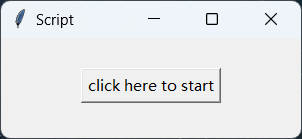

# 简介

这是一个将umaviewer导出的pmx文件中部分骨骼名称翻译为可被desktopmmd4桌宠软件使用的脚本，运行exe文件后，点击按钮即可自动翻译

# 使用

1. 用中文版pmxeditor打开pmx文件，并切换到骨骼界面，同时在屏幕中显示。

   
2. 启动本程序，并点击按钮开始自动转换（本脚本运行时间不到1分钟，在此期间会自动控制您的鼠标和键盘，如果要强行退出，建议ctrl + alt + delete）

   
3. 手动保存pmx文件，之后，它就可以用于desktopmmd4了
