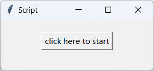

# 简介

这是一个将UmaViewer(katboi01/UmaViewer)导出的pmx文件中部分骨骼名称翻译为可被desktopmmd4桌宠软件使用的脚本

# 使用

1. 用中文版pmxeditor打开pmx文件，并切换到骨骼界面，同时在屏幕中显示。

   
2. 启动本程序，并点击按钮开始自动转换，运行时间1分钟左右，在此期间会自动控制您的鼠标和键盘，如果要强行退出，建议ctrl + alt + delete

   
3. 手动保存pmx文件，之后，它就可以用于desktopmmd4了，支持语音、跳舞等
   
   
   
   
